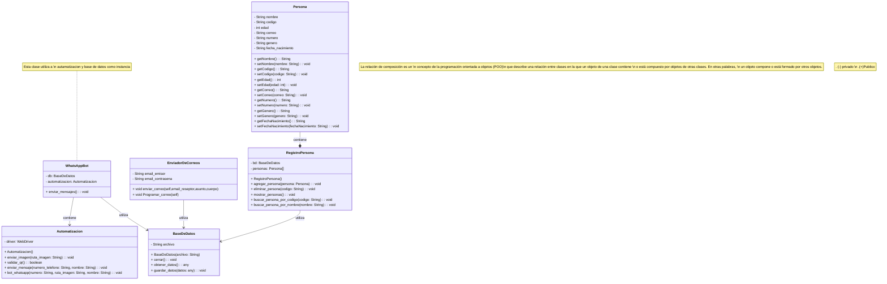

# Diagrama de clases Felicitaciones

```mermaid
classDiagram
    note for WhatsAppBot " Esta clase utiliza a \n autamatizacion y base de datos como instancia"
    note " La relación de composición es un \n concepto de la programación orientada a objetos (POO)\n que describe una relación entre clases en la que un objeto de una clase contiene \n o está compuesto por objetos de otras clases. En otras palabras, \n un objeto compone o está formado por otros objetos. "
    note " . (-) privado \n .(+)Publico"
    WhatsAppBot --> BaseDeDatos : utiliza
    Persona --* RegistroPersona : contiene
    EnviadorDeCorreos --> BaseDeDatos : utiliza
    RegistroPersona --> BaseDeDatos : utiliza
    WhatsAppBot --> Automatizacion : contiene

  
    class BaseDeDatos{
      - String archivo

        + BaseDeDatos(archivo: String)
        + cerrar(): void
        + obtener_datos(): any
        + guardar_datos(datos: any): void
        %% any se utiliza para datos flexibles.
    }
    class EnviadorDeCorreos{
      - String email_emisor
      - String email_contrasena
      + void enviar_correo(self,email_reseptor,asunto,cuerpo)
      + void Programar_correo(self)

    }

    class Persona{
        - String nombre
        - String codigo
        - int edad 
        - String correo 
        - String numero
        - String genero
        - String fecha_nacimiento
        + getNombre(): String
        + setNombre(nombre: String): void
        + getCodigo(): String
        + setCodigo(codigo: String): void
        + getEdad(): int
        + setEdad(edad: int): void
        + getCorreo(): String
        + setCorreo(correo: String): void
        + getNumero(): String
        + setNumero(numero: String): void
        + getGenero(): String
        + setGenero(genero: String): void
        + getFechaNacimiento(): String
        + setFechaNacimiento(fechaNacimiento: String): void
    }

    class RegistroPersona{
        - bd: BaseDeDatos
        - personas: Persona[]

        + RegistroPersona()
        + agregar_persona(persona: Persona): void
        + eliminar_persona(codigo: String): void
        + mostrar_personas(): void
        + buscar_persona_por_codigo(codigo: String): void
        + buscar_persona_por_nombre(nombre: String): void 
    }
    class WhatsAppBot {

    - db: BaseDeDatos
    - automatizacion: Automatizacion

    + enviar_mensajes(): void

    
  }
  class Automatizacion {
    - driver: WebDriver

    + Automatizacion()
    + enviar_imagen(ruta_imagen: String): void
    + validar_qr(): boolean
    + enviar_mensaje(numero_telefono: String, nombre: String): void
    + bot_whatsapp(numero: String, ruta_imagen: String, nombre: String): void
  }
       
    
```
