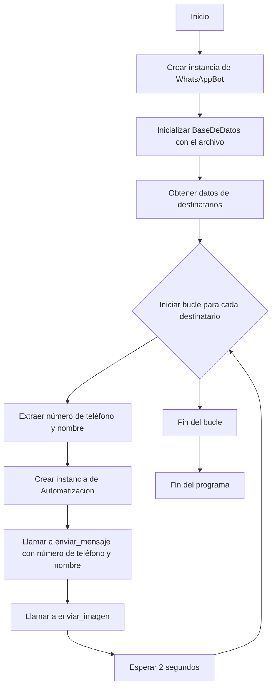

# Diagrama de Flujo 🤩

```mermaid


    flowchart TD
   
  A[Inicio] --> B[Crear instancia de WhatsAppBot];
  B --> C[Inicializar BaseDeDatos con el archivo];
  C --> D[Obtener datos de destinatarios];
  D --> E{Iniciar bucle para cada destinatario};
  E --> F[Extraer número de teléfono y nombre];
  F --> G[Crear instancia de Automatizacion];
  G --> H[Llamar a enviar_mensaje con número de teléfono y nombre];
  H --> I[Llamar a enviar_imagen];
  I --> J[Esperar 2 segundos];
  J --> E;
  E --> K[Fin del bucle];
  K --> L[Fin del programa];
       
    
```