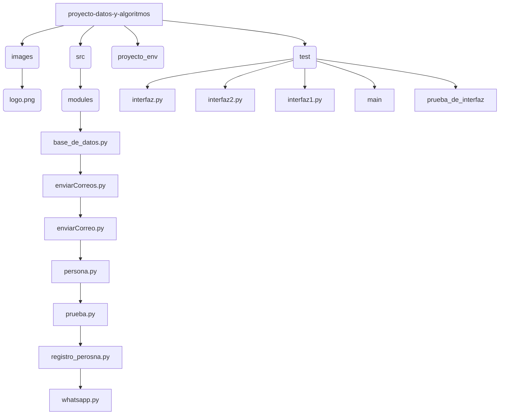

#Grafico para el direccionamiento de carpetas

```mermaid


    flowchart TD
        A[proyecto-datos-y-algoritmos]
        A-->B(images)
        A-->C(src)
        A-->D(proyecto_env)

        B-->E(logo.png)
        C-->F(modules)

        A-->G(test)
        G-->interfaz.py
        G-->interfaz2.py
        G-->interfaz1.py
        G-->main
        G-->prueba_de_interfaz
       
       F-->base_de_datos.py-->enviarCorreos.py-->enviarCorreo.py-->persona.py-->prueba.py-->registro_perosna.py-->whatsapp.py
       
    
```
