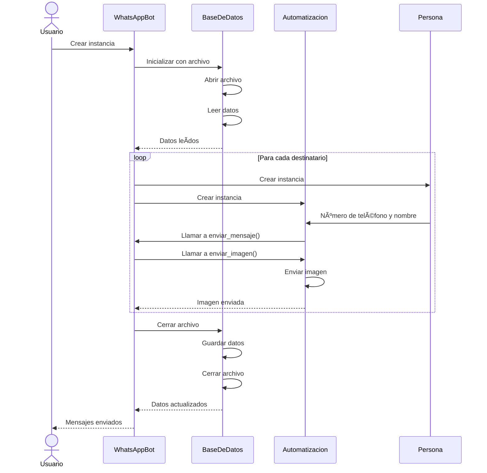

# Grafico diseño felicitaciones 🤩

```mermaid


sequenceDiagram
  actor Usuario
  participant WhatsAppBot
  participant BaseDeDatos
  participant Automatizacion
  participant Persona

  Usuario->>WhatsAppBot: Crear instancia
  WhatsAppBot->>BaseDeDatos: Inicializar con archivo
  BaseDeDatos->>BaseDeDatos: Abrir archivo
  BaseDeDatos->>BaseDeDatos: Leer datos
  BaseDeDatos-->>WhatsAppBot: Datos leídos
  loop Para cada destinatario
    WhatsAppBot->>Persona: Crear instancia
    WhatsAppBot->>Automatizacion: Crear instancia
    Persona->>Automatizacion: Número de teléfono y nombre
    Automatizacion->>WhatsAppBot: Llamar a enviar_mensaje()
    WhatsAppBot->>Automatizacion: Llamar a enviar_imagen()
    Automatizacion->>Automatizacion: Enviar imagen
    Automatizacion-->>WhatsAppBot: Imagen enviada
  end
  WhatsAppBot->>BaseDeDatos: Cerrar archivo
  BaseDeDatos->>BaseDeDatos: Guardar datos
  BaseDeDatos->>BaseDeDatos: Cerrar archivo
  BaseDeDatos-->>WhatsAppBot: Datos actualizados
  WhatsAppBot-->>Usuario: Mensajes enviados

    
```
